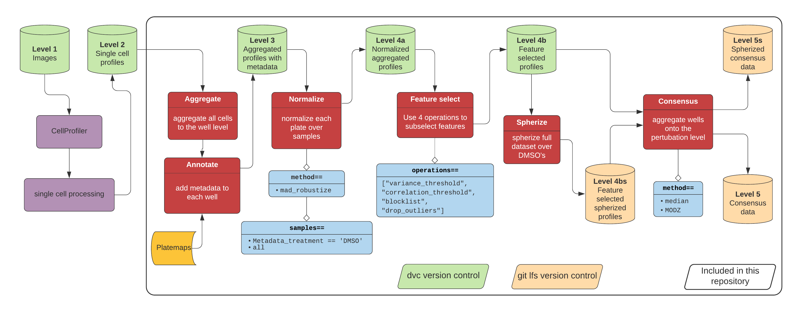

# Image-based profiling

Image-based profiling represents a series of data processing steps that turn image-based readouts into more manageable data matrices for downstream analyses ([Caicedo et al. 2017](https://doi.org/10.1038/nmeth.4397)).
Typically, you derive image-based readouts using software, like CellProfiler ([McQuin et al. 2018](https://doi.org/10.1371/journal.pbio.2005970)), that segment cells and extract so-called hand-engineered single cell morphology measurements.
In this folder, we process the CellProfiler derived morphology features for the LINCS Cell Painting dataset using [pycytominer](https://github.com/cytomining/pycytominer) - a tool enabling reproducible image-based profiling.

Specifically, we include:

1. Data processing scripts to perform the full unified, image-based profiling pipeline
2. Processed data for each Cell Painting plate (for several "data levels")
3. Instructions on how to reproduce the profiling pipeline

## Workflow



## Pycytominer

[Pycytominer](https://github.com/cytomining/pycytominer) is a code base built by @gwaygenomics et al.
It allows for easy processing of CellProfiler data and contains all functions that were used to create the data in this repository.
Below, we describe the different steps of the pipeline.
Please check the pycytominer repo for more details. 

The steps from Level 3 to Level 4b can be found in the [profile_cells](https://github.com/broadinstitute/lincs-cell-painting/blob/master/profiles/profile_cells.py) script, the steps for spherizing can be found in [this script](https://github.com/michaelbornholdt/lincs-cell-painting/blob/master/spherized_profiles/spherize-batch-effects.ipynb), and the final aggregation to the consensus data is found in [this notebook](https://github.com/broadinstitute/lincs-cell-painting/blob/master/consensus/build-consensus-signatures.ipynb).  

Note here that we do not include the intermediate step of generating `.sqlite` files per plate using a tool called [cytominer-database](https://github.com/cytomining/cytominer-database).
This repository and workflow begins after we applied cytominer-database.

### Aggregation

We use the [aggregation method](https://github.com/cytomining/pycytominer/blob/master/pycytominer/aggregate.py) twice in the workflow.
First at this point and later for the creation of the consensus profiles. 
Here, the median of all cells within a well is aggregated to one profiler per well. 
The aggregation method doesn't persist the metadata which is why this step is followed by an annotation step to add the MOA data and others.

### Normalization

[Normalization](https://github.com/cytomining/pycytominer/blob/master/pycytominer/normalize.py) can be done via different methods and over all wells in a plate or only the negative controls (DMSOs). 
In this case, we used `mad_robustize` method and both the output of the whole-plate and the DMSO normalization are saved in this repository. 
It is important to note that we normalize over each plate but not over the full batch.

### Feature selection

The [feature_select](https://github.com/cytomining/pycytominer/blob/master/pycytominer/feature_select.py) method incorporates `["variance_threshold", "correlation_threshold", "drop_na_columns", "drop_outliers"]`. 
We developed these functions to drop redundant and invariant features and to improve post processing.

### Spherizing

[Spherizing](https://github.com/cytomining/pycytominer/blob/c0d3e86aa64de8b1c6c3213d48937aab8e9d1c1d/pycytominer/operations/transform.py#L13) (aka whitening) is a transformation of the data that tries to correct batch effects. 
Within Pycytominer, Spherizing can be found in the normalization function.
Unlike the other normalizations, we perform spherizing on the full batch (all plates).
Check the code for details and relevant papers.

### Consensus

The [consensus](https://github.com/cytomining/pycytominer/blob/master/pycytominer/consensus.py) function is another step of aggregation and completes the pipeline. 
We aggregate the normalized and feature selected data (4b) via the Median or MODZ functions to consensus data. 
This means that each of the five replicates are combined to one profile representing one perturbation with a given dose.  

### Normalization vs Spherizing

While having the same overall goal, these two processes target different artifacts:
The normalization step simply aligns all plates by scaling each plates values to a "unit height". 
The specific transformation used is [`RobustMad`](https://github.com/cytomining/pycytominer/blob/372f1086318841670a916f20334333b06e6b84c9/pycytominer/operations/transform.py#L111).  

On the other hand, we use a spherize (a.k.a. whiten) transformation to adjust for plate and plate position effects (e.g. some plates may influence the data while the position within a plate could also create artifacts).
The spherize transformation adjusts for plate position effects by transforming the profile data such that the DMSO profiles are left with an identity covariance matrix. 
Note that this operation is done on the full dataset, not per plate.
See [spherize-batch-effects.ipynb](spherized_profiles/spherize-batch-effects.ipynb) for implementation details.

Since CellProfiler data is not naturally normalized to zero, mean all data is 'MadRobustized' before Spherizing to maximize the usefulness of the spherize transformation.   

## Data levels

We include two batches of Cell Painting data in this repository: `2016_04_01_a549_48hr_batch1` and `2017_12_05_Batch2`.

### CellProfilier-derived profiles

For each batch, we include:

| Data level | Description | File format | Included in this repo? | Version control |
| :--------- | :---------- | :---------- | :--------------------- | :-------------- |
| Level 1 | Cell images | `.tif` | No^ | NA |
| Level 2 | Single cell profiles | `.sqlite` | No^ | NA |
| Level 3 | Aggregated profiles with metadata | `.csv.gz` | Yes | dvc |
| Level 4a | Normalized profiles with metadata | `.csv.gz` | Yes | dvc |
| Level 4b | Normalized and feature selected profiles with metadata | `.csv.gz` | Yes | dvc |
| Level 5 | Consensus perturbation profiles | `.csv.gz` | Yes | git lfs |

Importantly, we include files for _two_ different types of normalization: Whole-plate normalization, and DMSO-specific normalization.
See [profile_cells.py](profile_cells.py) for more details.

> Note: If you use normalized profiles without feature selection, you may need to remove additional outlier features.
See [issues/65](https://github.com/broadinstitute/lincs-cell-painting/issues/65) for more details and a list of features.

#### Batch corrected profiles

For each batch we include four different spherized profiles. 
These data include all level 4b profiles for every batch. 

| Batch | Input data | Spherized output file | Version control |
| :---: | :--------: | :-------------------: | :-------------- |
| 2016_04_01_a549_48hr_batch1 | DMSO normalized | 2016_04_01_a549_48hr_batch1_dmso_spherized_profiles_with_input_normalized_by_dmso.csv.gz | git lfs |
| 2016_04_01_a549_48hr_batch1 | Whole plate normalized | 2017_12_05_Batch2_dmso_spherized_profiles_with_input_normalized_by_whole_plate.csv.gz | git lfs |
| 2017_12_05_Batch2 | DMSO normalized | 2017_12_05_Batch2_dmso_spherized_profiles_with_input_normalized_by_dmso.csv.gz | git lfs |
| 2017_12_05_Batch2 | Whole plate normalized | 2017_12_05_Batch2_dmso_spherized_profiles_with_input_normalized_by_whole_plate.csv.gz | git lfs |

### Data access

We use a combination of [`git lfs`](https://git-lfs.github.com/) and [`dvc`](https://dvc.org/) to version all the data in this repository (see tables above for a breakdown).
In order to access the data locally, you must first install both services. 

```bash
# Download consensus profiles and spherized data
git lfs pull

# Download individual plate data
dvc pull
```

### DeepProfiler-derived profiles

TBD

## Reproduce pipeline

After activating the conda environment with:

```bash
conda activate lincs
```

you can reproduce the pipeline by simply executing the following:

```bash
# Make sure you are in the profiles/ directory
./run.sh
```

## Recoding dose information

The Drug Repurposing Hub collected data on 6 to 7 dose points per compound.
In general, most doses are very near the following 7 dose points (mmoles per liter):

> [0.04, 0.12, 0.37, 1.11, 3.33, 10, 20]

Therefore, to make it easier to filter by dose when comparing compounds, we first align the doses collected in the dataset to their nearest dose point above.
We then recode the dose points into ascending numerical levels and add a new metadata annotation `Metadata_dose_recode` to all profiles.

| Dose | Dose Recode |
| :--: | :---------: |
| 0 (DMSO) | 0 |
| ~0.04 | 1 |
| ~0.12 | 2 |
| ~0.37 | 3 |
| ~1.11 | 4 |
| ~3.33 | 5 |
| ~10 | 6 |
| ~20 | 7 |

## Critical details

There are several critical details that are important for understanding data generation and processing.
See [`profile_cells.py`](profile_cells.py) for more details about the specific processing steps and decisions.
